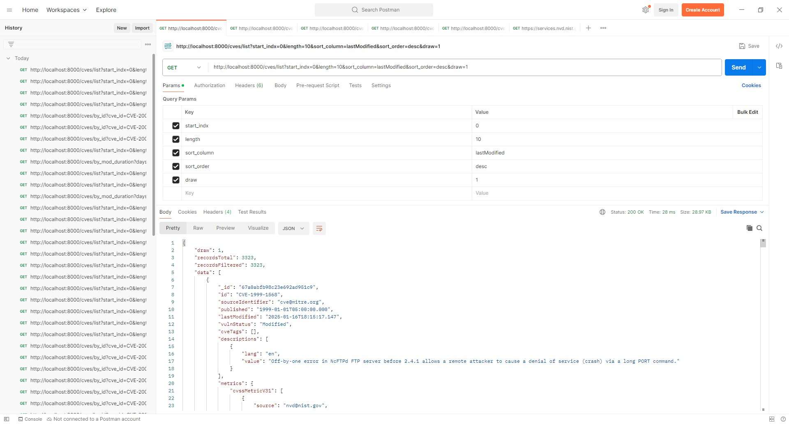
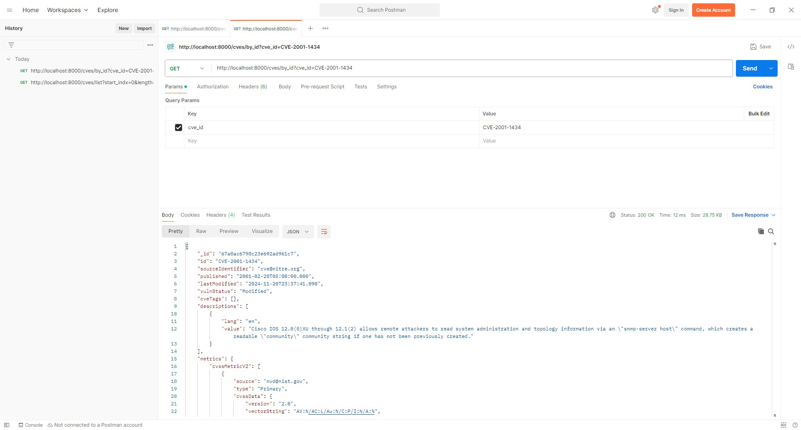
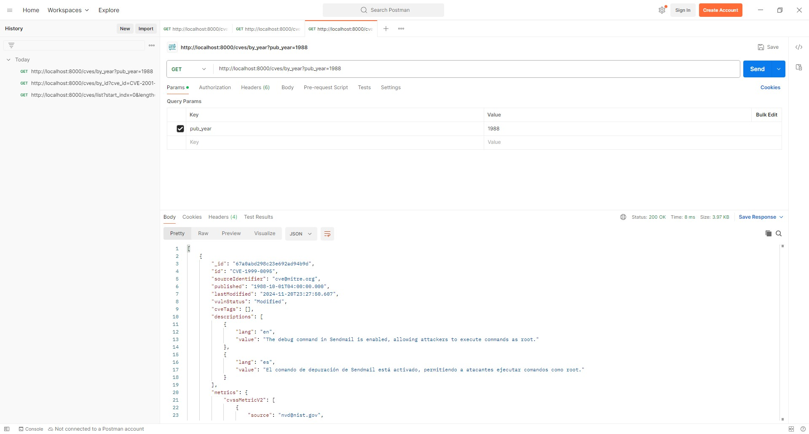
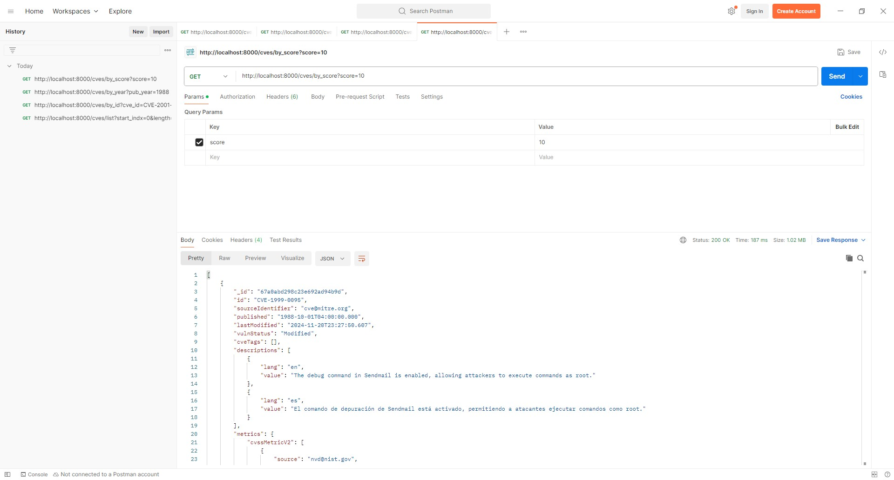
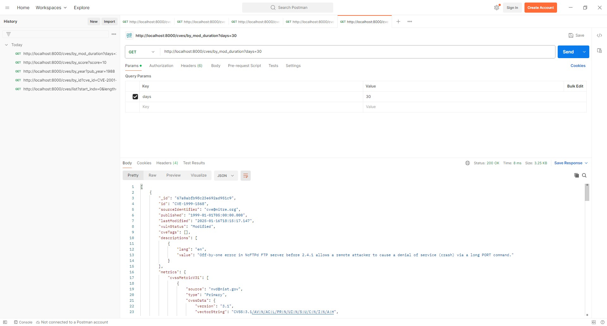
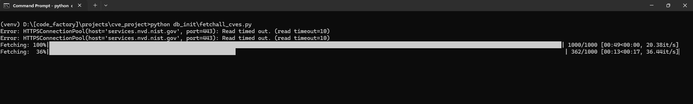
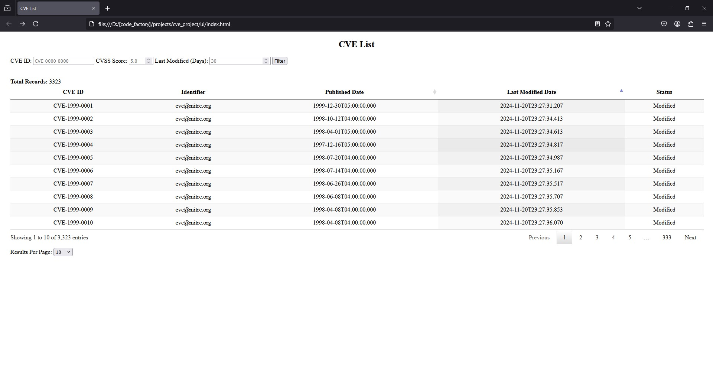
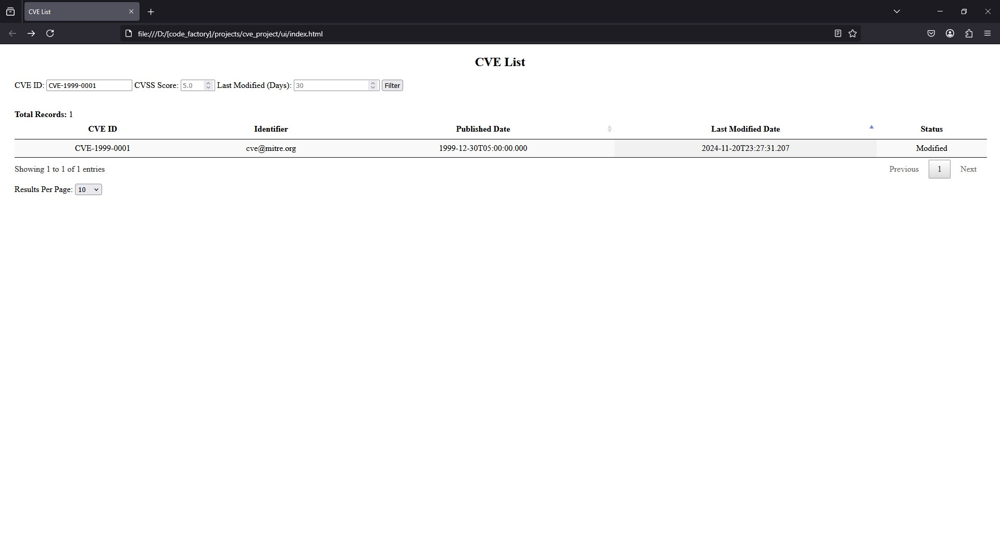

# cve_project

## Project Structure

```
CVE_PROJECT/
├── db_init/         # Database initialization scripts
├── rest_api/        # REST API implementation
├── ui/              # Frontend interface (index.html displays CVEs)
├── venv/            # Virtual environment for dependencies
├── requirements.txt # List of dependencies to be downloaded
```

## How It Works

1. **Database Initialization:**
   - Run `fetchall_cves.py` to fetch and populate the database with the latest CVEs.
   - This step is required only once during the initial setup.

2. **Automatic Updates:**
   - Schedule `sync_changes.py` as a cron job to execute every 6 hours to keep the database updated with new CVEs.

3. **REST API:**
   - The `rest_api/` directory contains code for all API endpoints that serve CVE data.
   - The API provides access to stored CVEs, allowing integration with other systems.

4. **User Interface:**
   - The `ui/index.html` page lists all CVEs stored in the database in a table format.
   - Open this file in a browser to view the data visually.

## Setup and Execution

### 1. Clone the Repository
```sh
git clone https://github.com/your-repo/cve-project.git
cd cve-project
```

### 2. Set Up Virtual Environment
```sh
python -m venv venv
source venv/bin/activate   # On macOS/Linux
venv\Scripts\activate      # On Windows
```

### 3. Install Dependencies
```sh
pip install -r requirements.txt
```

### 4. Initialize the Database
```sh
python fetchall_cves.py
```

### 5. Schedule Automatic Updates
- Add the following cron job (Linux/macOS) to execute updates every 6 hours:
  ```sh
  0 */6 * * * /path/to/python /path/to/sync_changes.py
  ```
- On Windows, use Task Scheduler to run `sync_changes.py` every 6 hours.

### 6. Run the API Server
```sh
cd rest_api
uvicorn main:app --reload
```

### 7. View the UI
- Open `ui/index.html` in a browser to see the list of CVEs.

## REST API Documentation

### **1. Get CVE List**
**Endpoint:** `GET /cves/list`

**Query Parameters:**
- `start_indx` (int, default: 0) - Starting index (must be >= 0)
- `length` (int, default: 10) - Number of results to return (1-100)
- `sort_column` (string, default: `lastModified`) - Sort by `published` or `lastModified`
- `sort_order` (string, default: `desc`) - Sort order `asc` or `desc`

**Example Request:**
```sh
curl -X GET "http://localhost:8000/cves/list?start_indx=0&length=10&sort_column=lastModified&sort_order=desc&draw=1"
```



### **2. Get CVE by ID**
**Endpoint:** `GET /cves/by_id`

**Query Parameters:**
- `cve_id` (string, required) - CVE ID to fetch

**Example Request:**
```sh
curl -X GET "http://localhost:8000/cves/by_id?cve_id=CVE-2024-0001"
```



### **3. Get CVE by Year**
**Endpoint:** `GET /cves/by_year`

**Query Parameters:**
- `pub_year` (int, required) - Year of publication (1900-current year)

**Example Request:**
```sh
curl -X GET "http://localhost:8000/cves/by_year?pub_year=2023"
```



### **4. Get CVE by Score**
**Endpoint:** `GET /cves/by_score`

**Query Parameters:**
- `score` (float, required) - CVE score (0.1 - 10.0)

**Example Request:**
```sh
curl -X GET "http://localhost:8000/cves/by_score?score=7.5"
```



### **5. Get CVE by Modification Duration**
**Endpoint:** `GET /cves/by_mod_duration`

**Query Parameters:**
- `days` (int, required) - Number of days since last modification

**Example Request:**
```sh
curl -X GET "http://localhost:8000/cves/by_mod_duration?days=30"
```



## Screenshots
### Input (Fetching CVEs)


### Output (CVE List in UI)


### Output (Filtered CVE List in UI)
